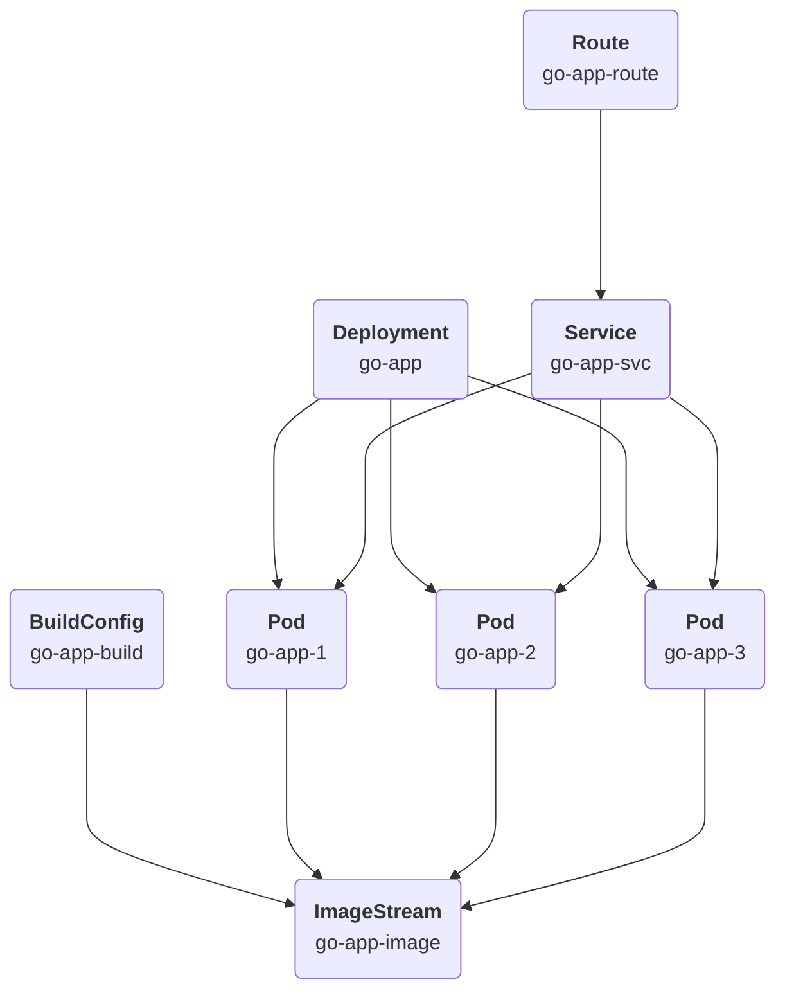
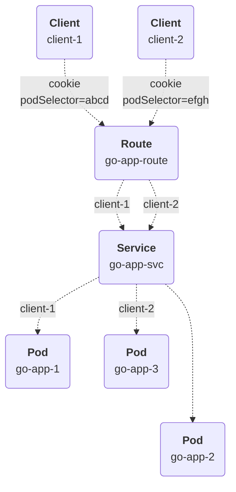

# Validate sticky cookies (aka session affinity) in OpenShift routes
This repository provides the source and configuration code to validate the usage of sticky sessions in the OpenShift Routes,
as described in 
[Using cookies to keep route statefulness](https://docs.openshift.com/container-platform/4.10/networking/routes/route-configuration.html#nw-using-cookies-keep-route-statefulness_route-configuration).

## Application architecture
The validation application consists of a simple Go application controlled by a Deployment instance and exposed by a network Route:



The Route is configured to use the `pod-selector` cookie to configure session persistence:
```yaml
metadata:
  annotations:
    router.openshift.io/cookie_name: 'pod-selector'
```

This cookie ensures that all the client requests using a given cookie will be routed to the same pod until the cookie expires:


The application simply returns a text with a fixed message made of:
* Pod name (taken from POD_NAME environment variable)
* Request path
* Value of the 'pod-selector' cookie
```bash
Response from Pod go-app-85c45845b5-pn8lg to path /path, with 'pod-selector' cookie: d6a534e1f7fc0c69dffcd318b8ffdbe0%
```

## Installing the application
```bash
oc create namespace go-app
oc project go-app
oc apply -f go-app.yaml
oc get pods --watch
```

## Validating the deployment
Test scripts are available under the [test](./test/) folder to validate different scenarios

### test.sh
The script [test.sh](./test/test.sh) is provided to run a given number of tests on the target host. Use it as:
```bash
test.sh <number of rounds> <target host> <target port>
```
A proper cookie descriptor following the [curl specifications](https://curl.se/docs/http-cookies.html) is created as `/tmp/cookie.txt` and used to
inject the cookie into the request.

The purpose of the script is to evaluate the session affinity behavior of the load balancer and to verify if the given cookie is received
by Pods receiving the requests.

#### Exposing the `go-app-svc` Service
Expose the Service to localhost:8080 and run some validation rounds: 
``` bash
oc port-forward svc/go-app-svc 8080:80
./test.sh 3 localhost 8080
```
Result: all the executions come from the same Pod, e.g. go-app-deployment-d4c4c4c99-mgdhz 
#### Second test
Delete the Pod as `oc delete pod go-app-dd9976d9c-sddw5` and repeat the test:
```bash
./test.sh 3 localhost 8080
```
Result: all the executions fail with 'Empty reply from server' error message

#### Conclusion
* Forwarding of Service port is not implementing any load balancing, it's always forwarding the request to the same Pod.
* The Pods receive the session cookie.
### runOnPod.sh
The script [runOnPod.sh](./test/runOnPod.sh) is meant to run the `go-app-svc` Service from the Pod's container. Use it as:
```bash
runOnPod.sh <number of rounds>
```
#### Initial test
Run some validation rounds on one of the Pods: 
``` bash
./runOnPod.sh 10
```
Result: the executions are distributed on all running Pods
#### Second test
Now, scale up the pods and repeat the test:
```bash
oc scale deployment/go-app --replicas 10
./runOnPod.sh 10
```
Result: again, the executions are distributed on all running Pods
#### Conclusion
* The session affinity annotation is not applied at the Service level
* The Pods receive the session cookie
### runOnRoute.sh
The script [runOnRoute.sh](./test/runOnRoute.sh) is provided to run a given number of tests on the Route host. Use it as:
```bash
runOnRoute.sh <number of rounds>
```
The initial cookie is fetched from the Route, saved as `/tmp/cookie.txt` and used to inject the cookie into the next requests.
#### Testing the Route
Run some validation rounds on the host of the Route: 
``` bash
./runOnRoute.sh 10
./runOnRoute.sh 10
./runOnRoute.sh 10
```
Result: 
* Every execution of the script is done in the same Pod (e.g., this is due to the sticky session cookie)
* Different executions of the script may work on different Pods, since they start from a new cookie
#### Conclusion
* The sticky cookie maintains the stateful sessions
* The session cookie is not transferred to the Pod, as can be seen from the response messages:
```bash
Response from Pod go-app-dd9976d9c-25zdn to path /path, with 'pod-selector' cookie: N/A
```
### runOnRouteAndKillThePod.sh
The script [runOnRouteAndKillThePod.sh](./test/runOnRouteAndKillThePod.sh) is provided to run a given number of tests on the Route host and then 
delete the pod in the middle of the test. Use it as:
```bash
runOnRouteAndKillThePod.sh <number of rounds>
```
The initial cookie is fetched from the Route, saved as `/tmp/cookie.txt` and used to inject the cookie into the next requests.

#### Testing the Route
Run the test: 
``` bash
./runOnRouteAndKillThePod.sh 10
```
Result: 
* First half of the tests are executed on the same Pod
* Last half of tests are performed on the remaining pods, with random assignment
#### Conclusion
* Sticky session cookie works until the target Pod is running
* Once the Pod is not responding, the next requests lose the stickyness, which might cause issues on the client side
* **TBD: find a reliable way to communicate the unavailability to the client, as they might start a new client session instead**

